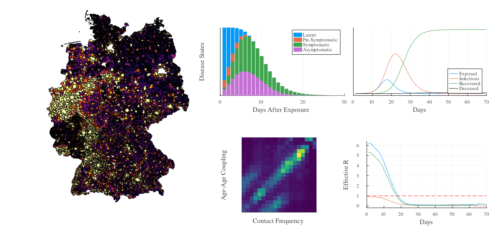

# German Epidemic Microsimulation System

[](https://immidd.github.io/GEMS)


The **G**erman **E**pidemic **M**icrosimulation **S**ystem (GEMS) is a high-performance geo-referential agent-based infectious disease modeling framework developed in Julia.
It is a research outcome of the BMBF-funded OptimAgent project.
It comes with a full model of the German population and allows to simulate the spread of infectious diseases and potential countermeasures such as isolation, testing, school- or workplace closure, contact-tracing, and many others.
GEMS provides interfaces to load custom populations, adapt infection rules, or change contact patterns.
It also comes with comprehensive post-processing and plotting features.
All simulated data can be easily exported and used in other applications. 



This page contains a few examples on how to use GEMS.
You'll find an extensive list of tutorials and examples in the official [GEMS documentation](https://immidd.github.io/GEMS/).


## Background

GEMS' core architecture and the integrated intervention modeling framework are discussed in these publications:

> Ponge, J., Horstkemper, D., Hellingrath, B., Bayer, L., Bock, W. and Karch, A., 2023, December. Evaluating Parallelization Strategies for Large-Scale Individual-based Infectious Disease Simulations. In *2023 Winter Simulation Conference (WSC)* (pp. 1088-1099). IEEE. https://doi.org/10.1109/WSC60868.2023.10407633

> Ponge, J., Suer, J., Hellingrath, B. and Karch, A., 2024, December. A Standardized Framework for Modeling Non-Pharmaceutical Interventions in Individual-Based Infectious Disease Simulations. In *2024 Winter Simulation Conference (WSC)* (pp. 1106-1117). IEEE. https://doi.org/10.1109/WSC63780.2024.10838778


## Quick Start

Assuming you have [Julia](https://julialang.org/downloads/) readily installed on your machine, getting GEMS is quite straight forward.
Load the package manager and install the GEMS-package:

```julia
using Pkg
Pkg.add(url = "https://github.com/IMMIDD/GEMS")
using GEMS
```

> [!NOTE]
> Simulations in GEMS and the post-processing routines are optimizeed for [multi-threading](https://docs.julialang.org/en/v1/manual/multi-threading/). Taking advantage of these features requires the Julia process to be started with multiple threads like `$ julia --threads 4` or like this to automatically start Julia with the maximum number of threads `$ julia --threads auto`.


## Simulations

This code creates the default simulation, runs it, processes the data and outputs a plot:

```julia
using GEMS
sim = Simulation()
run!(sim)
rd = ResultData(sim)
gemsplot(rd, xlims = (0, 200))
```

**Output**

```
[ Info: 09:52:18 | Initializing Simulation [Simulation 1]
[ Info: 09:52:18 | └ Creating population
[ Info: 09:52:19 | └ Creating simulation object
[ Info: 09:52:19 | Running Simulation Simulation 1
100.0%┣████████████████████████┫ 365 days/365 days [00:01<00:00, 387 days/s]
[ Info: 09:52:20 | Processing simulation data
        09:52:22 | └ Done  
```

**Plot**

<p align="center">
    
</p>

The `gemsplot()` function takes post-processed data (the `ResultData` object) and generates plots.
You can pass an optional type argument(e.g., `type = :TickCases`) to generate a specific plot.
Look up the documentation for the plot types that are available.

The `Simulation()` object can be created with many optional parameters.
Here's an example where we change the transmission rate and the average household size in the generated population:

```julia
using GEMS
sim = Simulation(transmission_rate = 0.3, avg_household_size = 5)
run!(sim)
rd = ResultData(sim)
gemsplot(rd, type = :TickCases, xlims = (0, 200), size = (600, 300))
```

<p align="center">
    
</p>

## Populations

The above examples use a default (radom) population which is being generated on-the-fly.
GEMS comes with population models for all German states and a full-country population model.
This example loads the population model for the state of Schleswig-Holstein (SH) and prints a map of the population density:

```julia
using GEMS
sim = Simulation(population = "SH")
gemsmap(sim, type = :PopDensityMap, clims = (0, 250))
```


If you want to add your own population, you can do that via a CSV-file or pass a `DataFrame` like this:

```julia
using GEMS, DataFrames
pop_df = DataFrame(
    id = collect(1:100_000),
    age = rand(1:100, 100_000),
    sex = rand(1:2, 100_000),
    household = append!(collect(1:50_000), collect(1:50_000))
)
my_pop = Population(pop_df)
sim = Simulation(population = my_pop)
```

The above example generates a population of 100,000 agents in 50,000 two-person households and randomly assigned ages (between 0 and 100) and sexes.


## Batches

In most cases, you probably want to run your simulation experiment multiple times.
Here's how to do that using GEMS' `Batch(...)` construct:

```julia
using GEMS

sims = Simulation[]
for i in 1:5
    sim = Simulation(label = "My Experiment")
    push!(sims, sim)
end

b = Batch(sims...)
run!(b)
rd = ResultData(b)
gemsplot(rd, type = :TickCases, xlims = (0, 200), size = (600, 200))
```

<p align="center">
    
</p>


Using batches, you can also sweep parameter spaces, e.g., for the transmission rate that applies when two individuals meet:

```julia
using GEMS

sims = Simulation[]
for i in 0:0.1:0.5
    sim = Simulation(transmission_rate = i, label = "Transmission Rate $i")
    push!(sims, sim)
end

b = Batch(sims...)
run!(b)
rd = ResultData(b)
gemsplot(rd, type = (:TickCases, :EffectiveReproduction), xlims = (0, 200), size = (600, 600))
```

<p align="center">
    
</p>


## Intervention Scenarios

GEMS integrates a highly versatile intervention modeling framework, called TriSM.
The *Trigger - Strategy - Measure* formalization allows to model complex intervention strategies in a unified framework.
Here's an example where we compare an unmitigated baseline scenario with an isolation scenario where individuals who experience symptoms go into self-isolation (no contacts outside of the household) for seven days:

```julia
using GEMS
# simulation without interventions
baseline = Simulation(label = "Baseline")

# simulation with 14-day isolation (at home) upon experiencing symptoms
scenario = Simulation(label = "Scenario")
self_isolation = IStrategy("Self Isolation", scenario)
add_measure!(self_isolation, SelfIsolation(14))
trigger = SymptomTrigger(self_isolation)
add_symptom_trigger!(scenario, trigger)

run!(baseline)
run!(scenario)

rd_b = ResultData(baseline)
rd_s = ResultData(scenario)

gemsplot([rd_b, rd_s], type = (:TickCases, :CumulativeDiseaseProgressions, :CumulativeIsolations))
```

<p align="center">
    
</p>

The above example scratch the surface of GEMS.
For more examples, please refer to the tutorials in the [package documentation](https://immidd.github.io/GEMS/).

## Resources Requirements

To run GEMS, you will need ~1GB per million agents.
The execution time scales with the number of infected agents.

## License

All files that belong to the GEMS are available under GPL-3.0 license.
