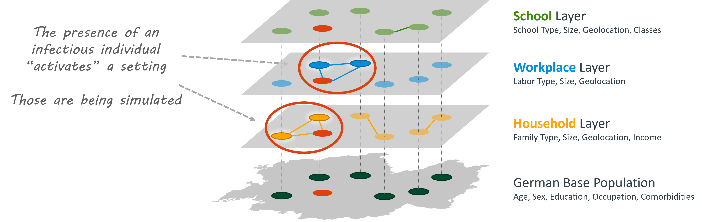

# Base Population Model

GEMS is a discrete-time static individual-based model with a superimposed network structure.
As such, all actions (contacts, infections, deaths, etc...) are being calculated for each timestep (e.g., a day) before incrementing to the next timestep.

## Individuals and Settings

The only two entities in GEMS are `Individual`s and `Setting`s.
*Individuals* are people that have personal characteristics, such as `age`, `sex`, and many more.
Look up the documentation of the `Individual` object to get a full list of parameters.

```@raw html
<p align="center">
    
</p>
```

*Settings* are the (physical or social) contexts in which contacts can occur.
A setting does always have a type (e.g., *Household* or *SchoolClass*) and can be geolocated.
Individuals can belong to an arbitrary number of settings but only one of each type.
Settings can hold an arbitrary number of individuals.


## Layered Architecture

GEMS' base model architecture was designed with parallelization in mind.
The model is segmented in disjunctive layers by setting type.
We assume that each individual is only assigned to one setting of a particular setting type (no individual is assigned to two households, for example).
This setup allows us to calculate all contacts and infections that happen during one timestep (e.g., one day) for all settings of a given type concurrently.
The image below illustrates how individuals of the base population (green dots on the bottom layer) can be assigned to settings on each of the layers.
A layer contains all settings of a given type (e.g., households).
The edges between individuals on any of the upper layers indicates that these individuals each belong to the same setting of the respective type.



Moreover, we only simulate infections in so-called *Active Settings*.
These are settings that contain infectious individuals and can therefore produce infections during the current timestep.
Settings without infectious individuals (in-active settings) are not being simulated as they do not contribute to the overall infection dynamics.
Active Settings in the image above are visualized with a white glow around the individuals.
Red circles are infectious individuals.

This approach cuts the simulation execution time drastically.
In our benchmarks, we were able to simulate 80 million agents for one year with 75% total infections in roughly 30 minutes on a 24 core machine.
We discuss these ideas in:

> Ponge, J., Horstkemper, D., Hellingrath, B., Bayer, L., Bock, W. and Karch, A., 2023, December. Evaluating Parallelization Strategies for Large-Scale Individual-based Infectious Disease Simulations. In *2023 Winter Simulation Conference (WSC)* (pp. 1088-1099). IEEE. https://doi.org/10.1109/WSC60868.2023.10407633


## Hierarchical Setting Structure

Many places, such as schools or workplaces, can be very large.
However, daily contacts often just occur between class mates or office colleauges.
GEMS arranges settings hierarchically to represent these nested structures.

```@raw html
<p align="center">
    
</p>
```

We differentiate between `IndividualSetting`s and `ContainerSetting`s.
The former are the settings that individuals have direct connections with.
They are the lowest-level settings (e.g., School classes, offices, or households).
The latter are the settings that aggregate the low-level settings to bigger ones (e.g., SchoolYears, Schools or Workplaces).

Individual Settings in GEMS are `Household`, `SchoolClass`, `Office`, and `Municipality`.
Container Settings are available for school classes and offices on four layers each:
`SchoolClass` -> `SchoolYear` -> `School` -> `SchoolComplex` and `Office` -> `Department` -> `Workplace` -> `WorkplaceSite`.

You can run a simulation with only Individual Settings.
Container Settings are added via so-called "settings files".