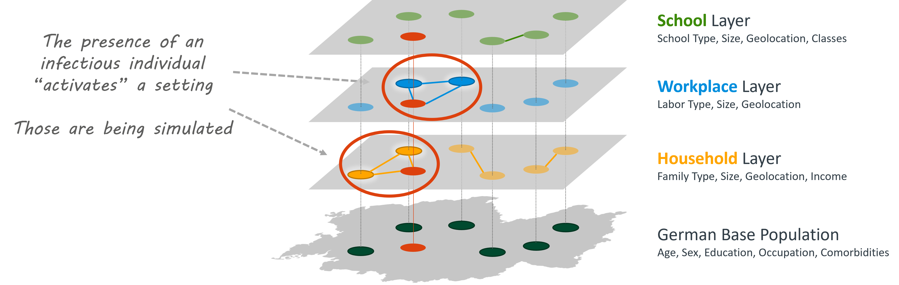

# Base Population Model

GEMS is a discrete-time static individual-based model with a superimposed network structure.
As such, all actions (contacts, infections, deaths, etc...) are being calculated for each timestep (e.g., a day) before incrementing to the next timestep.

## Individuals and Settings

Besides `Pathogen`s, the only other two entities in GEMS are `Individual`s and `Setting`s.
*Individuals* are people that have personal characteristics, such as `age`, `sex`, and many more.
They can also be extended to hold additional characteristics.

```@raw html
<p align="center">
    
</p>
```

*Settings* are the (physical or social) contexts in which contacts can occur.
A setting does always have a type (e.g., *Household* or *SchoolClass*) and can be geolocated.
Individuals can belong to any setting type but only one of each type.
The exact settings an Individual belongs to can be changed during the simulation (e.g., a person moving to a different household).
Settings can hold an arbitrary number of individuals and can't be created during the simulation.


## [Layered Architecture](@id pop-layers)

GEMS' base model architecture was designed with parallelization in mind.
The model is segmented in disjunctive layers by setting type.
We assume that each individual is only assigned to one setting of a particular setting type (i.e., no individual is assigned to two households).
This setup allows us to calculate all contacts and infections that happen during one timestep (e.g., one day) for all settings of a given type concurrently.
The image below illustrates how individuals of the base population (green dots on the bottom layer) can be assigned to settings on each of the layers.
A layer contains all settings of a given type (e.g., households).
The edges between individuals on any of the upper layers indicates that these individuals each belong to the same setting of the respective type.



Moreover, we only simulate infections in so-called *Active Settings*.
These are settings that contain infectious individuals and can therefore produce infectious contacts during the current timestep.
Settings without infectious individuals (in-active settings) are not being simulated as they do not contribute to the overall infection dynamics.
Active Settings in the image above are visualized with a white glow around the individuals.
Red circles are infectious individuals.

This approach cuts the simulation execution time drastically.
In our benchmarks, we were able to simulate over 80 million agents for one year with over 75% total infections in roughly 10 minutes on desktop hardware.
We discuss these ideas in:

> Ponge, J., Horstkemper, D., Hellingrath, B., Bayer, L., Bock, W. and Karch, A., 2023, December. Evaluating Parallelization Strategies for Large-Scale Individual-based Infectious Disease Simulations. In *2023 Winter Simulation Conference (WSC)* (pp. 1088-1099). IEEE. https://doi.org/10.1109/WSC60868.2023.10407633


## [Hierarchical Setting Structure](@id setting-hierarchy)

Many places, such as schools or workplaces, can be very large.
However, daily contacts often just occur between class mates or office colleagues.
GEMS arranges settings hierarchically to represent these nested structures.

```@raw html
<p align="center">
    
</p>
```

We differentiate between `IndividualSetting`s and `ContainerSetting`s.
The former are the settings that individuals have direct connections with.
They are the lowest-level settings (e.g., `SchoolClass`es, `Office`s, or `Household`s).
The latter are the settings that aggregate the low-level settings to bigger ones (e.g., `SchoolYears`, `Schools` or `Workplaces`).

Individual Settings in GEMS are `Household`, `SchoolClass`, `Office`, and `Municipality`.
Container Settings are available for school classes and offices on four layers each:
`SchoolClass` -> `SchoolYear` -> `School` -> `SchoolComplex` and `Office` -> `Department` -> `Workplace` -> `WorkplaceSite`.


# [Inbuilt Population Generator](@id pop-generator)

If you setup a simulation without a custom population file like `sim = Simulation()`, GEMS will generate a **non-representative** baseline population on-the-fly.
You can pass arguments `pop_size` (called `n` in the explanation below), `avg_household_size`, `avg_office_size`, and `avg_school_size` to the engine.

```@raw html
<p align="center">
    
</p>
```

The population generator will first set up an empty dataframe with one row per individual (Step 1) and add the required number of households with one index individual per household (Step 2).
Their ages will be randomly sampled from the German age distribution.
We then iteratively create the remaining individuals.
To get a somewhat realistic household age-coupling of individuals, we first select on of the index individuals and sample the age for a new household member based on household contact data from the [COVIMOD study](https://bmcmedicine.biomedcentral.com/articles/10.1186/s12916-021-02139-6) (Step 3).
In the last step, we sample a school ID for every agent between the ages of 6 and 18, and an office for all agents between the ages of 18 and 65.
While the example refers to "schools", they are internally handled as `SchoolClass`es.
