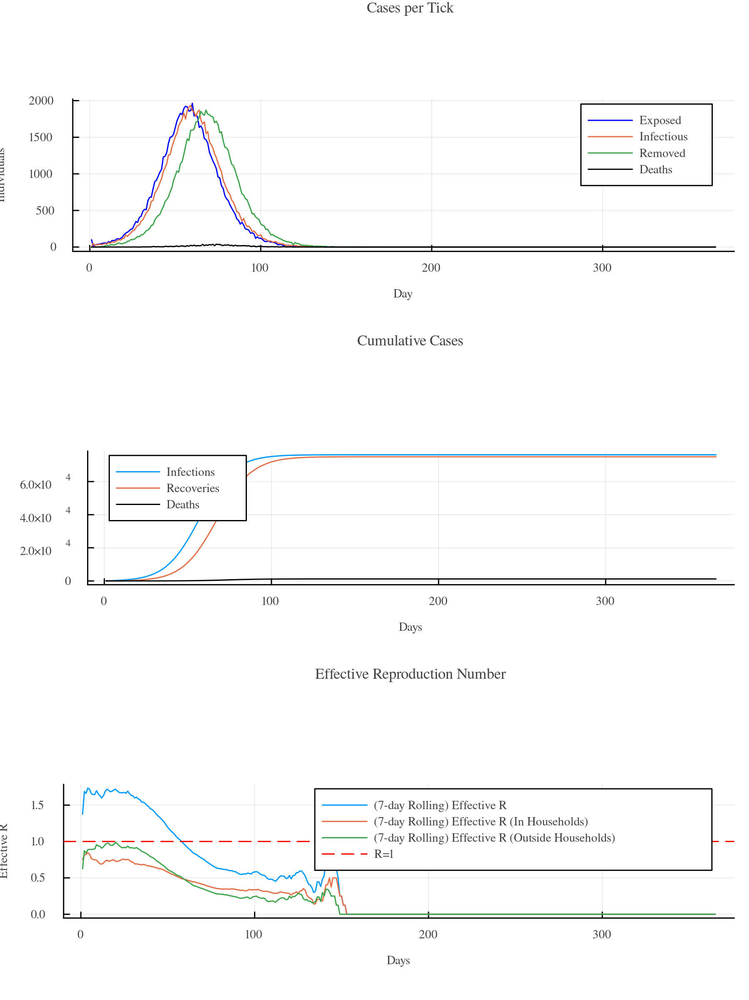
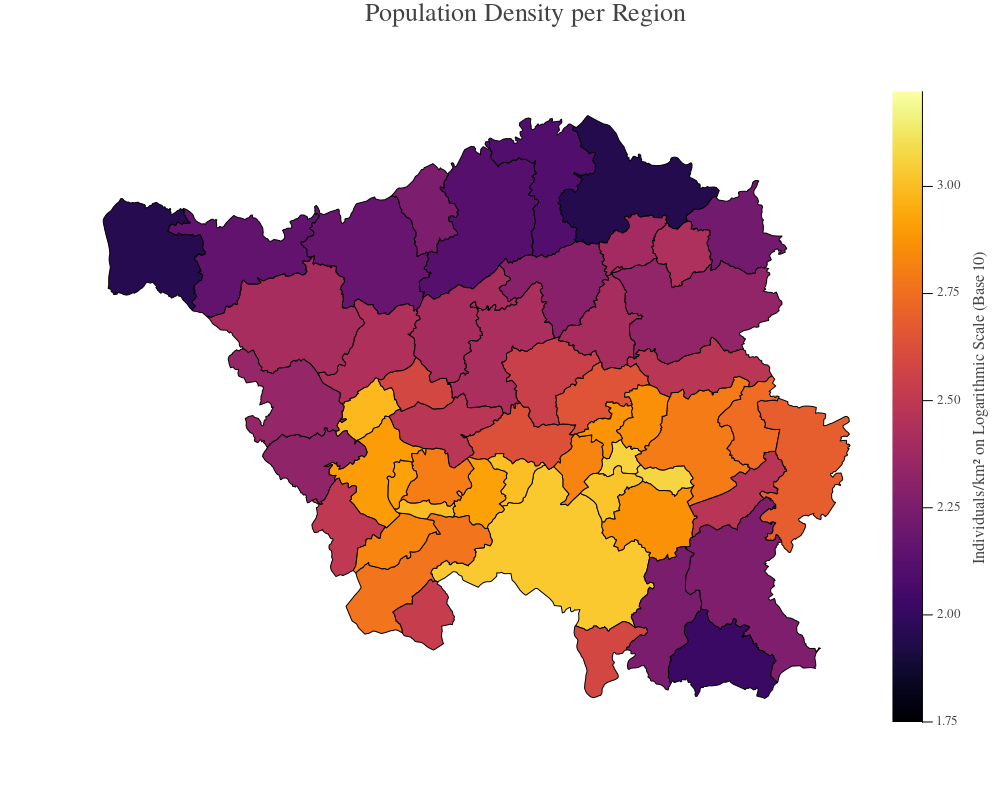
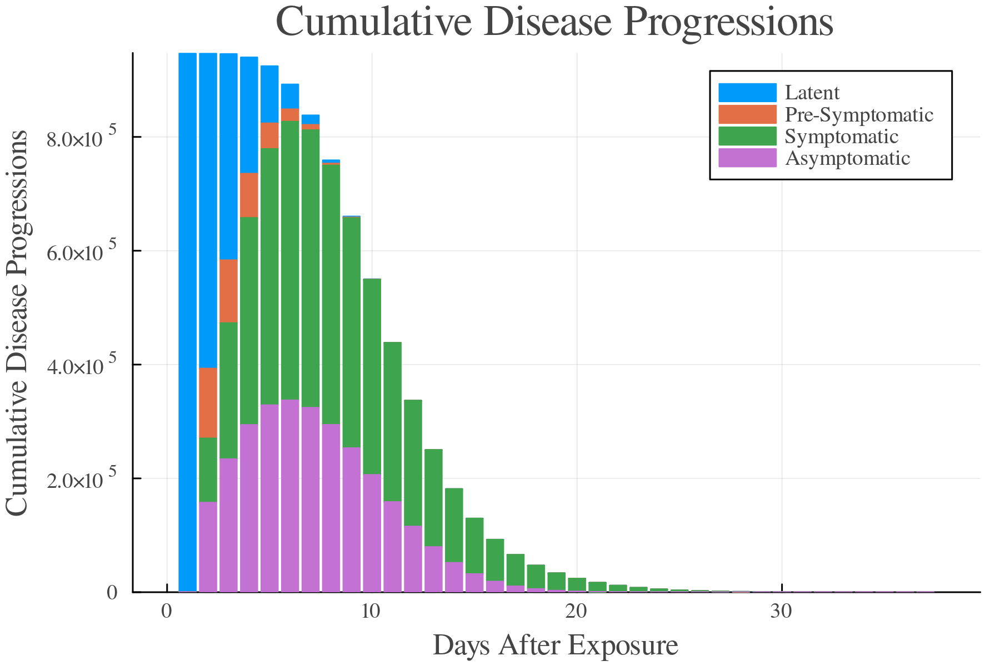
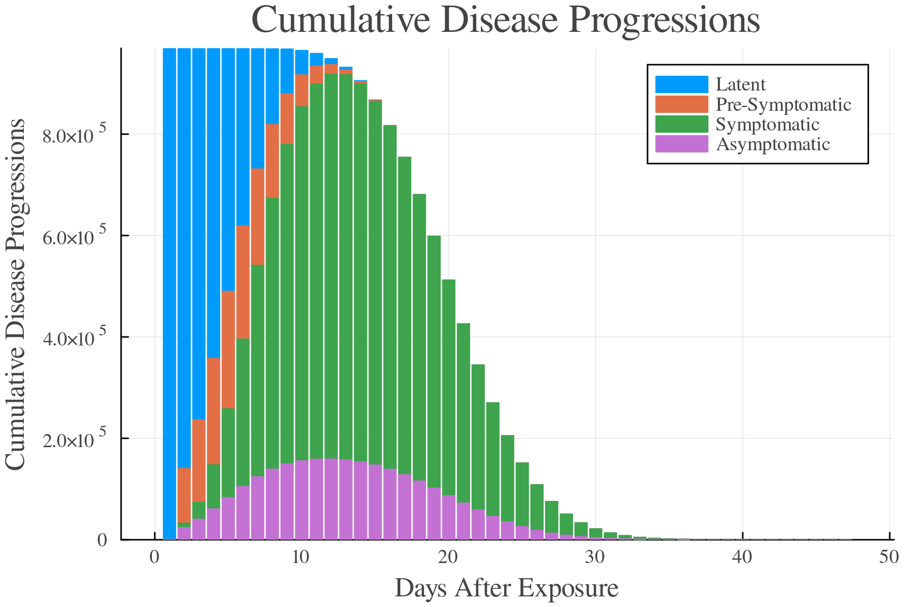
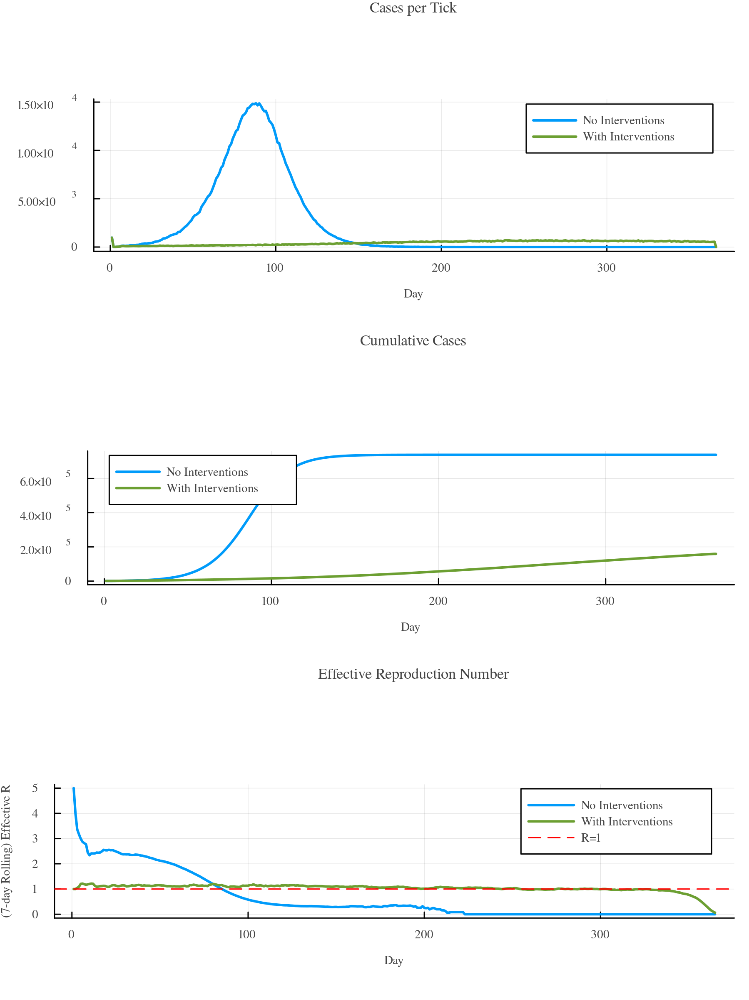
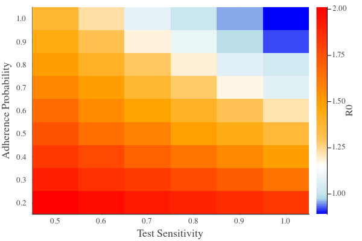
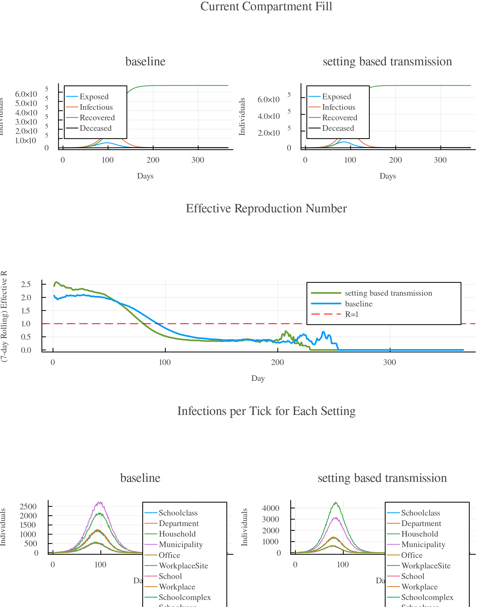

# [Modeling Case Study] (@id modeling-case-study)

In this case study, you will gradually build a fully reproducible epidemic model in GEMS — starting from a minimal simulation and progressing toward a fully parameterized, data-calibrated, and automated scenario.

You will begin with a **quickstart simulation** to verify that everything is working.  
After that, you will turn your case study into a **proper Julia project**, ensuring reproducibility and enabling batch simulations, calibration workflows, and structured output files.

Along the way, you’ll learn best practices for:
 - Structuring your own case study as a Julia project
 - Defining disease and population models
 - Implementing and testing interventions (TriSMs)
 - Running batch simulations and saving reproducible results

---

## 1. Scenario Summary

- **Objective:**  
  The objective of this modeling case study is to investigate how the effectiveness of testing-based containment strategies depends on both test sensitivity and individual adherence to isolation mandates.  
  In the first part of the study, we systematically vary test sensitivity and population-level compliance to determine how sensitive diagnostic tests must be to achieve outbreak control under different behavioral conditions.  
  In the second part, we extend the analysis to include test-result delays, examining how the timeliness of detection further influences epidemic outcomes.  
  Together, these experiments aim to identify combinations of test performance and adherence that are sufficient to suppress transmission in a realistic, heterogeneous population.

- **Pathogen:** SARS-CoV-2-like, wild type.

- **Population:** Around one million agents with realistic demographic structure based on census data, including age, sex, employment status, and household composition (size, family type, care homes, nursery schools, universities). *(Saarland model)*

- **Settings:** Each agent is associated with multiple hierarchical settings where contacts occur:
  - **Households:** including care homes, with realistic sizes and family types.
  - **Schools:** subdivided into school, school year, and class, including nursery schools and universities.
  - **Workplaces:** subdivided into workplace, department, and office.
  - **Municipality:** simulates semi-random local encounters outside household, school, or workplace contexts.

- **Interventions:**
  - Testing with variable sensitivity and delays  
  - Isolation/quarantine following positive tests  
  - Variable adherence (some agents may not comply)

- **Outcome questions:**
  - How does test sensitivity affect outbreak control?
  - What proportion of the population must comply with measures for effective control?
  - How do test result delays influence disease dynamics?

---

## 2. Getting Started

### 2.2 Prerequisites
Before starting, make sure you have the following installed:

- **Julia** (required)
- **VS Code** (recommended editor, especially if you are new to programming)

See the [Installation Guide](@installation.md) if needed.

---

### 2.3 Running Your First Simulation

Before we begin with proper project structuring, let’s run a **minimal simulation** to verify that GEMS is correctly installed.  
Afterwards, we will restructure your work into a reproducible project.

#### Step 0 — Create a working folder
Create an empty folder anywhere on your computer, for example:
`case_study/`

Open this folder in **VS Code**.

#### Step 1 — Create a new Julia script
In VS Code, click the *New File* icon and create a file named:
`first_simulation.jl`


#### Step 2 — Start the Julia REPL
Press: `Ctrl+Shift+P → “Julia: Start REPL”`

A Julia terminal will open at the bottom of the window.

---

#### Step 3 — Activate a local environment and install GEMS
This ensures your case study is fully reproducible and does not modify your global environment.

In the REPL:

```julia
julia> using Pkg
julia> Pkg.activate(".")    # activate the case study folder as a project
julia> Pkg.add(url = "https://github.com/IMMIDD/GEMS")
```

#### Step 4 — Load GEMS in your script

Add the following at the top of first_simulation.jl:
```julia
using GEMS
```

#### Step 5 — Create and run a simple simulation
```julia
sim = Simulation()
run!(sim)
```

#### Step 6  — Plot the results
```julia
rd = ResultData(sim)
gemsplot(rd)
```

#### Step 7 — Run the Script

Press:

- **Alt + Enter** → run current line or selection  
- **Ctrl + Shift + Enter** → run the entire file  
- or click the **Run** button in VS Code

This should produce a plot similar to:

```@raw html
<p align="center">
    
</p>
```

Now that we’ve verified everything works, we will gradually replace the defaults with realistic epidemiological assumptions.
We’ll start with the population, then specify disease progression, and finally configure age-specific risks.

## 3. Building the Simulation Pipeline
In this chapter, we construct the simulation workflow step by step—defining model parameters, calibrating transmission, adding interventions, running batches, and generating outputs. Each component becomes part of a reusable pipeline that we will refine throughout the case study.

### 3.1 Model Parameterization
So far, you have run a simulation using only the default settings.  
Defaults are useful for quick testing, but to model a *realistic* epidemic scenario we need to specify:

- the **population**,  
- the **disease parameters**

#### 3.1.1 Population

For this case study, we use the **Saarland population**, consisting of about one million agents with realistic demographic structure:

- age and sex distributions  
- employment status  
- household sizes and family structures  
- institutions (care homes, nursery schools, schools, universities)

This level of detail allows realistic heterogeneity in contact patterns.

```julia
sim = Simulation(population = "SL")
gemsmap(sim, type = :PopDensityMap)
```
```@raw html
<p align="center">
    
</p>
```

#### 3.1.2 Disease

Before applying interventions, we need a disease model that roughly matches the epidemiology of a SARS-CoV-2-like infection.
We begin by running the simulation with the default pathogen parameters provided by GEMS. This gives us an initial reference curve for how infections progress over time in the population. The resulting *CumulativeDiseaseProgressions* plot shows the total number of individuals who have entered each disease state, forming the baseline against which we will later compare our SARS-CoV-2-specific parameterization.

```julia
run!(sim)
rd = ResultData(sim)

gemsplot(rd, type = :CumulativeDiseaseProgressions)
```

```@raw html
<p align="center">
    
</p>
```

Next, we replace the default pathogen parameters with values tailored to a SARS-CoV-2-like disease. These parameters affect when individuals become infectious, when symptoms appear, and how long recovery takes. After updating the simulation, we rerun it to observe how these assumptions shape the epidemic dynamics.

We now specify parameters for a **SARS-CoV-2-like SEIR disease**, based on values from the literature:

- **Symptom onset:** 6.55 days after exposure  
- **Infectiousness begins:** 2 days before symptom onset  
- **Recovery time:** 13.4 days after symptom onset  
- **Asymptomatic proportion:** 17%  
- **Clinical severity:** 80% mild, 0% severe, 3% critical

Real diseases affect different age groups differently.  
We use age-specific probabilities (Verity et al. 2020):

- **0–39 years:** 0.2% fatality  
- **40–59 years:** 0.9%  
- **60–79 years:** 5%  
- **80+ years:** 14.8%  

```julia
using GEMS, Distributions

t_symptom = 6.55
t_infectious = t_symptom - 2.0      # = 4.55
t_recovery_sym = 13.4               # after symptom onset

# Asymptomatic
dp_asym = Asymptomatic(
    exposure_to_infectiousness_onset = Poisson(t_infectious),
    infectiousness_onset_to_recovery = Poisson(t_recovery_sym)
)

# Symptomatic
dp_sym = Symptomatic(
    exposure_to_infectiousness_onset      = Poisson(t_infectious),
    infectiousness_onset_to_symptom_onset = Poisson(2.0),
    symptom_onset_to_recovery             = Poisson(t_recovery_sym)
)

dp_sev  = Severe(
    exposure_to_infectiousness_onset     = Poisson(1.0),
    infectiousness_onset_to_symptom_onset = Poisson(1.0),
    symptom_onset_to_severeness_onset     = Poisson(1.0),
    severeness_onset_to_severeness_offset = Poisson(7.0),
    severeness_offset_to_recovery          = Poisson(4.0)
)

dp_crit = Critical(
    exposure_to_infectiousness_onset       = Poisson(1.0),
    infectiousness_onset_to_symptom_onset  = Poisson(1.0),
    symptom_onset_to_severeness_onset      = Poisson(1.0),
    severeness_onset_to_hospital_admission = Poisson(2.0),
    hospital_admission_to_icu_admission    = Poisson(2.0),
    icu_admission_to_icu_discharge         = Poisson(7.0),
    icu_discharge_to_hospital_discharge    = Poisson(7.0),
    hospital_discharge_to_severeness_offset = Poisson(3.0),
    severeness_offset_to_recovery           = Poisson(4.0),
    death_probability                       = 0.3,
    icu_admission_to_death                  = Poisson(10.0)
)

dp_hosp = Hospitalized(
    exposure_to_infectiousness_onset        = Poisson(1.0),
    infectiousness_onset_to_symptom_onset   = Poisson(1.0),
    symptom_onset_to_severeness_onset       = Poisson(1.0),
    severeness_onset_to_hospital_admission  = Poisson(2.0),
    hospital_admission_to_hospital_discharge = Poisson(7.0),
    hospital_discharge_to_severeness_offset = Poisson(3.0),
    severeness_offset_to_recovery           = Poisson(4.0)
)

# Progression assignment
pa = AgeBasedProgressionAssignment(
    age_groups = ["-39", "40-59", "60-79", "80-"],
    progression_categories = [
    "Asymptomatic",
    "Symptomatic",
    "Severe",
    "Hospitalized",
    "Critical"],
   stratification_matrix = [
    [0.17, 0.828, 0, 0, 0.002],
    [0.17, 0.821, 0, 0, 0.009],
    [0.17, 0.78, 0, 0, 0.05],
    [0.17, 0.682, 0, 0, 0.148]]
    )

# Pathogen
p = Pathogen(
    id = 1,
    name = "Covid",
    progressions = [dp_asym, dp_sym, dp_sev, dp_hosp, dp_crit],
    progression_assignment = pa
)

# Run simulation
sim = Simulation(pathogen=p, population= "SL")
run!(sim)
rd = ResultData(sim)
gemsplot(rd, type = :CumulativeDiseaseProgressions)
```

```@raw html
<p align="center">
    
</p>
```

With the new parameters applied, the cumulative progression curves now reflect a COVID-like disease. The timing and magnitude of transitions between states (exposed, infectious, symptomatic, and recovered) differ from the default model. This refined behavior provides the epidemiological foundation for all further analyses in the case study, including the evaluation of interventions.

Each parameter influences how quickly the disease spreads and how the outbreak evolves.

**Note:** The transmission rate is not included here because we will calibrate it later to achieve a target R₀. Unlike the other parameters, we do not assume a literature-based value, so it will be determined through simulation and R₀ fitting.

#### 3.1.3 Using Configuration Files

Configuration files let you centralize all simulation parameters in a single place, making your model easier to read, modify, and version-control. Rather than specifying parameters directly in the `Simulation` constructor, you place them in a `.toml` file and load them automatically.

A good practice is to create a folder called `config/` in your case study project and place your file there, for example:

```
case_study/
  config/
    sarscov2.toml
  scripts/
  results/
```

You can start from scratch or copy an existing template. Example configuration files are available in:

- the [GEMS repository](https://github.com/IMMIDD/GEMS) under `data/`
- the [GEMS-Tutorial repository](https://github.com/IMMIDD/GEMS-Tutorial) under `models/`

For this tutorial, you can start from the default configuration template (e.g., `default_config.toml`). Any other template would work as well, since we will modify most entries later.

At this point, you should transfer all model parameter values that were previously hard-coded in the constructor into the configuration file except for the population.

To use the configuration file, simply pass its path to the simulation:

```julia
sim = Simulation(configfile = "config/sarscov2.toml", population="SL")
```
This keeps your simulation setup clean, reproducible, and easy to update as the case study grows.

### 3.2 Calibration (R₀ Fitting)

With population structure and disease progression now specified, the simulation captures the biological course of infection but not yet its speed of spread.  
To obtain realistic epidemic dynamics, we now calibrate the transmission rate so that the model reproduces a target R₀.

```julia
sim = Simulation(population="SL", configfile = "models/model_parametrization.toml")
run!(sim)
rd = ResultData(sim)
println("R0 = ", r0(rd))
```
**Output**
```
R0 = 5.335272877334159
```
This R₀ is much higher than the literature value (≈3.28), so the default transmission rate is too strong.

Before we can explore interventions, we first need a calibrated transmission rate that reproduces the literature R₀ (≈3.25–3.28 for SARS-CoV-2 wild-type).  
The default simulation produced a much higher value, so we will systematically test different transmission rates to find the correct one.

The calibration workflow has four steps:

1. **Run simulations across transmission rates** to see how the epidemic responds.  
2. **Extract outcome metrics** (early R₀, total infections, household infection fraction) using helper functions.  
3. **Summarize and save results** to ensure reproducibility.  
4. **Visualize outcomes** to select the transmission rate that matches the target R₀.

We start by defining **helper functions** that process the output of each simulation.

```julia
using GEMS, JLD2, DataFrames, Statistics

# creates dictionary with outcome variables from the output of a simulation
function outcomes(rd)
    return Dict(
        "scenario" => label(rd),
        "r0" => effectiveR(rd).effective_R[1:10] |> mean,
        "infections" => total_infections(rd),
        "infections_at_home" => tick_cases_per_setting(rd) |>
            df -> df[df.setting_type .== 'h',:] |>
            df -> sum(df.daily_cases) / total_infections(rd)
    )
end

# builds a flat dataframe from a vector of outcome dictionaries
function df_from_outcomes(outcomes::Vector)
    res = DataFrame(
        scenario = [],
        r0 = [],
        infections = [],
        infections_at_home = []
    )

    for o in outcomes
        push!(res, (o["scenario"], o["r0"], o["infections"], o["infections_at_home"]))
    end

    return res
end

# builds mean of outcomes dataframe (from rd objects of simulation runs)
function summarize_outcomes(outcomes_df)

    return outcomes_df |>
        x -> groupby(x, :scenario) |>
        x -> combine(x,
            :r0 => mean => :r0,
            :infections => mean => :infections,
            :infections_at_home => mean => :infections_at_home,
        )
end
```
Next, we run simulations for a range of transmission rates.  
Each rate is tested multiple times to account for stochastic variability.

```julia
rds = ResultData[]

for i in 0.01:0.001:0.04
    for y in 1:3
        sim = Simulation(configfile="models/model_parametrization.toml", population="SL")
        sim.label = "TR: $i"
        pathogen(sim).transmission_function = ConstantTransmissionRate(transmission_rate = i)
        run!(sim)
        rd = ResultData(sim)
        push!(rds, rd)
    end
end
```
Finally, we summarize the outcomes, save the results for reproducibility and print the simulation with the transmission rate that matches our R₀ the best.
(Edit the `target_r0` variable to get the transmission rate for other R₀ values.)

```julia
outc = outcomes.(rds) |> df_from_outcomes |> summarize_outcomes

JLD2.save_object(joinpath("results", "R0_fitting.jld2"), outc)

target_r0 = 3.25
closest = outc[findmin(abs.(outc.r0 .- target_r0))[2], :]
println(closest)
```

**Outcome**
```
DataFrameRow
 Row │ scenario   r0       infections  infections_at_home 
     │ Any        Float64  Float64     Float64
─────┼────────────────────────────────────────────────────
  19 │ TR: 0.028  3.24108   9.31472e5             0.30119
```

The table above shows the transmission rate scenario whose early epidemic R₀ is closest to our target of 3.25.  
In this case, a transmission rate of 0.028 produces an R₀ of 3.24 which is slightly lower than the target, but much closer than the default rate.

Next, we run a simulation using the calibrated transmission rate to verify that the epidemic curve aligns with our target R₀.

```julia
fitted = Simulation(configfile = "models/r0_fitted.toml", population="SL")
run!(fitted)
rd_f = ResultData(fitted)
println(r0(rd_f))
```
**Output**
```
3.24108
```

### 3.3 Interventions
In this section, we define a **reusable intervention strategy**: testing combined with isolation. This is the core “intervention” concept, and all later experiments build on it. 

We encapsulate the testing and isolation strategy in a function `test_and_isolation(sim; ...)`:

- Create a new **antigen test** with configurable sensitivity and specificity.  
- Define a **self-isolation strategy** that is applied after a positive test.  
- Combine the test and isolation into a **TriSM**, triggered by symptoms.  
- Apply optional **delays** and **conditions** to testing and isolation.


```julia
function test_and_isolation!(sim::Simulation; 
    test_sensitivity::Float64 = 1.0, 
    test_specificity::Float64 = 1.0, 
    test_condition::Function = i -> true,                         
    isolation_condition::Function = i -> true,
    test_delay::Function = i -> 0,
    isolation_delay::Function = i -> 0)
    
    antigen_test = TestType("Antigen Test", pathogen(sim), sim, 
    sensitivity=test_sensitivity, specificity=test_specificity)

    # define self isolation strategy
    self_isolation = IStrategy("Self Isolation", sim)
    add_measure!(self_isolation, SelfIsolation(14), 
    delay=isolation_delay, condition=isolation_condition)

    # define testing strategy that triggers self isolation
    testing = IStrategy("Testing", sim)
    add_measure!(testing, Test("Test", antigen_test, 
    positive_followup=self_isolation), delay = test_delay, condition=test_condition)

    # trigger testing on symptoms
    trigger = SymptomTrigger(testing)
    add_symptom_trigger!(sim, trigger)
end
```
By encapsulating the intervention in a function, we can easily reuse it for multiple parameter combinations.

We can now use the function to run the intervention scenario against the baseline scenario:

```julia
baseline = Simulation(label="No Interventions", population="SL", configfile="r0_fitted.toml")
scenario = Simulation(label="With Interventions", population="SL", configfile="r0_fitted.toml")

test_and_isolation!(scenario)

run!(baseline)
run!(scenario)

rd_b = ResultData(baseline)
rd_s = ResultData(scenario)

gemsplot([rd_b, rd_s])
```

```@raw html
<p align="center">
    
</p>
```

### 3.4 Batch Simulations
We know that neither the test sensitivity nor the mandate adherence will be perfect. That is why we will investigate now which combinations are "good enough", in the sense that it will keep the R value under 1 and stop the epidemic. 

We define ranges for the two variables we want to study:

- `sensitivities`: the range of test sensitivities (0.5 to 1.0)  
- `adherences`: the probability that an individual complies with isolation (0.2 to 1.0)

We also create empty vectors to store the results for plotting later.

```julia
using GEMS

include("../02-model-parametrization/custom_transmission.jl")
include("../04-interventions/scenario.jl")

xvals = Float64[]
yvals = Float64[]
outvals = Float64[]

sensitivities = 0.5:0.1:1.0
adherences = 0.2:0.1:1.0
```

We loop over all combinations of test sensitivity and adherence:

- Create a new `Simulation` object for each combination.  
- Apply the `test_and_isolation` intervention with the current parameter values.  
- Run the simulation and extract the outcome (R₀).  
- Store the results in the vectors for plotting.

```julia
sims = Simulation[]

for sens in sensitivities
    for adh in adherences
        # store for heatmap
        push!(xvals, sens)
        push!(yvals, adh)
        
        # create simulation
        sim = Simulation(label = "Test-Adherence Scenario", 
                         configfile="models/r0_fitted.toml", population="SL")

        # define test + isolation strategy
        tick_test_and_isolation!(sim; 
            test_sensitivity = sens,
            isolation_condition = i -> gems_rand(sim) < adh,
            trigger_interval = Int16(7)
        )
        push!(sims, sim)
    end
end

# create a Batch from the vector of simulations
batch = Batch(sims...)

# run all simulations in the batch
run!(batch)

# collect results
bd = BatchData(batch)

# extract R0 for each run to build the heatmap
outvals = Float64[]

runs = bd.data["sim_data"]["runs"]

for run in runs
    push!(outvals, r0(run))
end
```
Running multiple simulations like this allows us to systematically explore the parameter space and understand how test performance and adherence interact.

Generate a **heatmap** of R₀ as a function of test sensitivity and adherence probability:

```julia
gemsheatmap(
    xvals, yvals, outvals;
    xlabel = "Test Sensitivity",
    ylabel = "Adherence Probability",
    colorbar_title = "R0",
    color = :r0
)
```

The heatmap shows which combinations of test sensitivity and adherence are sufficient to reduce R₀ below 1, helping to identify effective containment strategies.

```@raw html
<p align="center">
    
</p>
```

### 3.5 Analyzing Outputs

#### 3.5.1 Saving Results
#### 3.5.2 Result Data Styles

## 4. Model Refinement and Iteration
### 4.1 Custom Transmission Functions

Calibrating a single constant transmission rate gives us the correct overall R₀, but it still assumes that all contacts are equally risky.
This is rarely realistic. In particular, infections in our fitted simulation are spread fairly evenly across settings, while in real outbreaks a large fraction of secondary infections occur inside households due to prolonged close contact.

If we inspect the results from the calibrated simulation, we usually find that: the household fraction of infections is lower than expected, contacts in schools or workplaces are treated as equally risky as household contacts, interventions that target specific settings (e.g., household isolation) cannot be represented accurately.

Setting-based transmission allows us to assign higher transmission probabilities to certain environments (e.g., households) and lower ones elsewhere, while still preserving the calibrated R₀ on average.

To keep your case study organized, we recommend defining a custom transmission function in a separate file and including it using `include("file.jl")`.
This keeps your main script clean and makes it easy to iterate on the model design.

#### Setting-based Transmission

GEMS supports custom transmission functions via user-defined structs.
Below is an example using a `SettingRate` transmission function that assigns different transmission probabilities to households and all other settings.

First, configure the function in TOML:

```@TOML
### Pathogen section of the config file ###

[Pathogens]
    [Pathogens.Covid19]
        [Pathogens.Covid19.transmission_function]
            type = "SettingRate"
            [Pathogens.Covid19.transmission_function.parameters]
                general_rate = 0.028
                household_rate = 0.03
```

Then implement the transmission function in Julia:

```julia
using GEMS
using Parameters
import GEMS.transmission_probability

# define custom transmission struct
@with_kw mutable struct SettingRate <: GEMS.TransmissionFunction
    household_rate::Float64
    general_rate::Float64
end

# override transmission probability function for your struct
function GEMS.transmission_probability(transFunc::SettingRate,
    infecter::Individual, infected::Individual,
    setting::Setting, tick::Int16)::Float64

    # if the agent has already been infected (natural immunity)
    if number_of_infections(infected) > 0
        return 0.0
    end

    # if the contact setting is a household, return household_rate
    # and the general_rate otherwise
    return isa(setting, Household) ? transFunc.household_rate : transFunc.general_rate
end
```

More details and other examples are provided [here](@tut_configfiles.md).

Now you can run a simulation with your custom transmission function. 
We also run a baseline simulation to see what has changed.

```julia   
include("custom_transmission.jl")  # loads your custom function

baseline = Simulation(label="baseline", population="SL", configfile = "r0_fitted.toml")
setting_based_transmission = Simulation(label="setting based transmission", 
population="SL", configfile = "models/custom_transmission.toml")

run!(baseline)
run!(setting_based_transmission)

rd_b = ResultData(baseline)
rd_t = ResultData(setting_based_transmission)

rds = [rd_b, rd_t]

gemsplot(rds, type = (:CompartmentFill, :EffectiveReproduction, :TickCasesBySetting))
```

**Plot**
```@raw html
<p align="center">
    
</p>
```

### 4.2 Contact Structure
#### 4.2.1 Contact Matrices
#### 4.2.2 Contact Sampling
### 4.3 Recalibration
### 4.4 Extending Outcomes

## 5. Discussion & Evaluation

## Packaging the Case Study for Reproducibility

### Create a Julia Package
- In VS Code, make sure you have the Julia extension installed.
- Open a folder where you want your package to be created.  
  *(If you don’t open a folder, the package will be generated in a default location that may be hard to find.)*
- Start the Julia REPL inside VS Code:  
  `Ctrl+Shift+P` and type *“Julia: Start REPL”* then press Enter  
  (A terminal will open with the Julia REPL running.)
- Enter **package mode** by typing `]` in the REPL.
```julia
julia> ]
```
- Generate your new package:
```julia
(@v1.11) pkg> generate MySimulation
```

This creates a new Julia project called `MySimulation` (you can choose a different name).
- Switch into your new project folder (in normal Julia mode, i.e. after pressing backspace to leave package mode):
  ```julia
  cd("MySimulation")
  ```
- Check you’re in the correct directory:
  ```julia
  pwd()
  ```
  *(The output should end with `/MySimulation`.)*
- Activate the project environment:
  ```julia
  ] activate .
  ```
- Test that the generated project works:
  ```julia
  using MySimulation
  MySimulation.greet()
  ```
  *(This should print a greeting message.)*  
  *(TODO: optionally include a screenshot of the console output.)*


### Setting Up the Simulation Framework
First, add **GEMS** to your project environment using this installation command:

```julia
using Pkg
Pkg.add(url = "https://github.com/IMMIDD/GEMS")
```
We will also need the following other packages:

```julia
Pkg.add("Dates")
```
```julia
Pkg.add("Plots")
```

- In `src/MySimulation.jl`, remove the `greet()` function and add the following functions:
```julia
using GEMS
using Dates
using Plots

export run_all

"""
result_folder()

Creates the path to a new result folder.
"""
function result_folder()
    folder = joinpath("results", Dates.format(Dates.now(), "yyyy-mm-dd_HH-MM-SS_sss"))
    mkpath(folder)
    return folder
end


"""
run_all()

Runs a simple example simulation and saves results.
"""
function run_all()
    # create a results folder
    folder = result_folder()

    # initialize the simulation object
    sim = Simulation()

    # run the simulation
    run!(sim)

    rd = ResultData(sim)

    # plot the results
    p = gemsplot(rd)

    # save the results
    savefig(p, joinpath(folder, "sim_plot.png"))

    println("Simulation finished. Results saved to: $folder")
end
```
- `result_folder()`  
  Creates a new results directory with a timestamp in its name.  
  This keeps outputs from different simulation runs separated and organized.

- `run_all()`  
  Sets up a new results folder, initializes and runs a basic simulation, and then saves a simple plot of the results.
  This function provides a minimal working example. We will extend and modify it throughout the tutorial as we add more complex scenarios and analyses.

---

Now you can run the simulation by entering
```julia
using MySimulation
run_all()
```
either in the Julia console or from a separate script.

Note: The functions are listed in the `export` line so they can be called directly (e.g. `run_all()`).  
If you don’t export them, you would need to call them with the module name, like `MySimulation.run_all()`.
